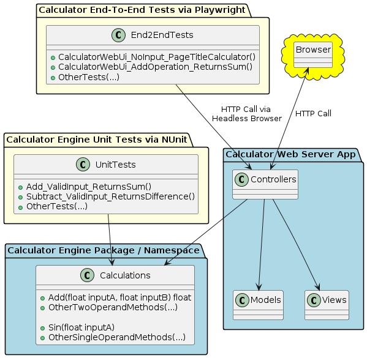
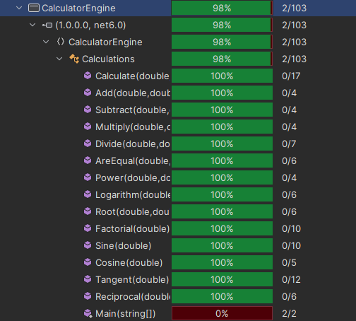

# KSU SWE 3634 Software Testing and Quality Assurance Semester Project: Web-Based Calculator

Hi! I'm your first Markdown file in **StackEdit**. If you want to learn about StackEdit, you can read me. If you want to play with Markdown, you can edit me. Once you have finished with me, you can create new files by opening the **file explorer** on the left corner of the navigation bar.


## Table of Contents

- [Environment](#environment)
- [Executing the Web Application](#executing-the-web-application)
- [Executing Unit Tests](#executing-unit-tests)
- [Reviewing Unit Test Coverage](#reviewing-unit-test-coverage)
- [Executing End-To-End Tests](#executing-end-to-end-tests)
- [Final Video Presentation](#final-video-presentation)

## Team Members

Brodey McGinnis

## Architecture


- The web server app references the calculator engine, sending the user input and receiving back the results of calculations
- The calculator engine unit test references the calculator engine and directly tests the calculator logic
- The end-to-end tests reference the html of the running web server app and tests the functionality 
## Environment

This application is cross-platform and should work on Windows 10+, Mac OSx Ventura+, and Linux environments, however it was exclusively developed and tested using Windows 11.

To prepare your environment to execute this application:

 1. [Install .NET SDK](https://dotnet.microsoft.com/download)

To configure Playwright for end-to-end testing:

 1. Open command prompt
 2. Run the following command to install Playwright for end-to-end testing:
 `dotnet tool install --global Microsoft.Playwright.CLI`

## Executing the Web Application

The web application is able to run from either the command line or an IDE like JetBrains Rider.

To run from the command line:

 1. Open command prompt/terminal
 2. Locate the location of CalculatorWebServerApp.csproj and copy the path
 3. Run the project with the command `dotnet run --project C:path/CalculatorWebServerApp.csproj` (replace C:path/CalculatorWebServerApp.csproj with the copied path)
 4. After the application starts, launch a browser and connect to http://localhost:7277 or http://localhost:5238

Sample output:
```
info: Microsoft.Hosting.Lifetime[14]
      Now listening on: https://localhost:7277
info: Microsoft.Hosting.Lifetime[14]
      Now listening on: http://localhost:5238
info: Microsoft.Hosting.Lifetime[0]
      Application started. Press Ctrl+C to shut down.
info: Microsoft.Hosting.Lifetime[0]
      Hosting environment: Development
info: Microsoft.Hosting.Lifetime[0]
```

## Executing Unit Tests

 1. Open command prompt/terminal
 2. Locate the location of CalculatorEngineUnitTests.csproj and copy the path
 3. Run the project with the command `dotnet test C:path/CalculatorEngineUnitTests.csproj` (replace C:path/CalculatorEngineUnitTests.csproj with the copied path)


Sample Output:
```
Starting test execution, please wait...
A total of 1 test files matched the specified pattern.

Passed!  - Failed:     0, Passed:    22, Skipped:     0, Total:    22, Duration: 34 ms - CalculatorEngineUnitTests.dll (net8.0)
```

## Reviewing Unit Test Coverage


All calculator functions received 100% coverage. The 2 uncovered lines are the empty main method.

## Executing End-To-End Tests

 1. Repeat the steps to [executing the web application](#executing-the-web-application) as it will need to be running to perform the end-to-end tests. 
 2. Open another command prompt/terminal
 3. Run the tests with the command `dotnet test C:path/CalculatorEndtoEndTests.csproj` (replace C:path/CalculatorEndtoEndTests.csproj with the copied path)

 Sample Output:
 ```
 Starting test execution, please wait...
A total of 1 test files matched the specified pattern.

Passed!  - Failed:     0, Passed:     5, Skipped:     0, Total:     5, Duration: 5 s - CalculatorEndToEndTests.dll (net8.0)
```

## Final Video Presentation
[Youtube link]()

